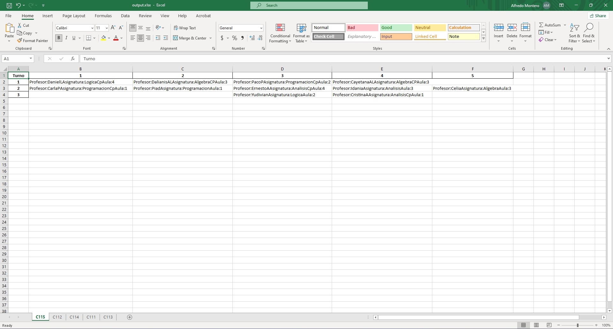

# Schedule Planner

## Integrantes ##

- Leonardo Amaro Rodríguez C411
- Alfredo Montero López C411
- Anthuán Montes de Oca C411

## Requerimientos
Para poder ejecutar el programa se necesita tener instalado Python 3.8 o superior y las librerías puestas en requirements.txt

## Configuración del entorno de desarrollo
Para configurar tu entorno de desarrollo, sigue estos pasos:  
1. Clona el repositorio: git clone https://github.com/pixeldashgames/Schedule-Planner
2. Navega al directorio del proyecto: cd \<nombre del proyecto\>
3. Instala las dependencias: `pip install -r requirements.txt`

## Instrucciones de ejecución
Para ejecutar el programa se debe correr el archivo main.py con el comando `py main.py` en la terminal.

# Informe: Planificador de Horarios

## Descripción del Proyecto
Este proyecto fue realizado para dar solución al problema de la confección del horario de MATCOM. El objetivo de este trabajo es diseñar e implementar una aplicación para la confección automática del horario en MATCOM.  Se tienen en cuenta las restricciones reales a la hora de confeccionar el horario en la facultad.

El proyecto se desarrolló utilizando la biblioteca OR-Tools en Python. El sistema considera asignaturas, profesores, aulas, grupos de estudiantes, días y turnos.
## Introducción a la Programación de Restricciones (CP)

La Programación de Restricciones (CP) es un paradigma de programación declarativa que permite codificar problemas de decisión complejos modelando sus restricciones y buscando soluciones que las satisfagan. En lugar de especificar un procedimiento paso a paso para llegar a la solución, en la Programación de Restricciones se describe el problema en términos de variables y restricciones sobre estas variables.

El modelo matemático subyacente en la Programación de Restricciones es un problema de satisfacción de restricciones (CSP), que se puede formular de la siguiente manera:

- Se tiene un conjunto de variables, cada una con un dominio de posibles valores.
- Se tienen restricciones que especifican las combinaciones de valores que las variables pueden tomar.
- El objetivo es encontrar una asignación de valores a las variables que satisfaga todas las restricciones. En algunos casos, también se puede buscar la mejor solución según una función objetivo.

Por ejemplo, si estamos tratando de programar un horario de clases, las variables podrían ser los tiempos de inicio de cada clase, las restricciones podrían ser que ninguna clase puede superponerse con otra, y la función objetivo podría ser minimizar el tiempo total de las clases.

## Componentes del Proyecto

1. **`solucion.py`**:
   - Contiene la lógica principal para resolver el problema del horario.
   - Utiliza OR-Tools para crear un modelo de restricciones con variables, restricciones y una función objetivo.
   - Verifica si la solución propuesta cumple con todas las condiciones (por ejemplo, disponibilidad de profesores, capacidad de las aulas, etc.).

2. **`utils.py`**:
   - Define clases para representar los parámetros del problema:
     - `Asignatura`: Representa una materia académica.
     - `Profesor`: Representa un docente.
     - `Aula`: Representa un espacio físico.
     - `Grupo`: Representa un grupo de estudiantes.
     - Otras clases para días, turnos, etc.

3. **`main.py`**:
   - Ejecuta el proceso de planificación del horario.
   - Inicializa los parámetros del problema (asignaturas, profesores, aulas, grupos, etc.).
   - Llama al solucionador desde `solucion.py`.
   - Recibe la solución optimizada del horario.

4. **`printer.py`**:
   - Contiene métodos para formatear y exportar la solución del horario.
   - Convierte la solución en un archivo Excel (llamado `output.xlsx`) con hojas separadas para cada grupo.
### Input
El programa lee la información de los parámetros del problema desde datos.json. Este archivo contiene la información de las asignaturas, profesores, aulas, grupos y restricciones del problema.
Para entrar los datos solo tiene que llenar los datos en datos.json.

El json tiene la forma:

      {
   
         "subjects": [],   // Nombres de las asignaturas

         "subject_times": { asignatura : número },   // Cantidad de turnos por semana que debe tener cada asignatura

         "teachers": [],   // Nombres de todos los profesores

         "classrooms": [],  // Nombres de las aulas

         "groups": [],  // Nombres de los grupos

         "group_subject_times": { grupo : { asignatura : frecuencia }}, // Frecuencia que debe tener cada asignatura por cada grupo en la semana

         "shifts": [],  // Turnos existentes en el día

         "days": [],  // Días de la semana que se van programar

         "teachers_to_subjects": { profesor : [ asignatura ] }  // Asignación de cada profesor a su asignatura correspondiente

         "hards_true": {
            "(nombre de la restriccion)": {  
            "teachers_names": [],
            "subjects_names": [],
            "classrooms_names": []
            "groups_names": []],
            "shifts": [],
            "days": []
            },
            ...
         },  // Restricciones que deben cumplirse

         "hards_false": {

            "(nombre de la restriccion)":{  
               "teachers_names": [],
               "subjects_names": [],
               "classrooms_names": [],
               "groups_names": [],
               "shifts": [],
               "days": []
            },
            ...
         }, // Restricciones que deben  no cumplirse

         "softs_max": {
            (nombre de la restriccion):{  
               "teachers_names": [],
               "subjects_names": [],
               "classrooms_names": [],
               "groups_names": [],
               "shifts": [],
               "days": [],
               "alpha": (number)
            },
            ...
         },

         "softs_min": {
            (nombre de la restriccion):{  
               "teachers_names": [],
               "subjects_names": [],
               "classrooms_names": [],
               "groups_names": [],
               "shifts": [],
               "days": [],
               "alpha": (number)
            },
            ...
         },
      }

Se puede basar en los datos de ejemplo ya existentes en el json.
### Output
El programa genera un archivo Excel llamado output.xlsx que contiene el horario optimizado para cada grupo. Cada hoja del archivo Excel representa el horario de un grupo en particular.
Ejemplo:

# Reporte técnico
## Introducción a OR-Tools
OR-Tools es una biblioteca de software de código abierto que proporciona herramientas para la optimización de operaciones. Fue desarrollada por Google y se utiliza para resolver problemas de programación lineal y entera, programación de restricciones, programación de metas, programación de flujo de red y problemas de rutas de vehículos, entre otros.  La biblioteca OR-Tools proporciona una interfaz para varios solucionadores de optimización, tanto de código abierto como comerciales. Esto incluye solucionadores para problemas de programación lineal y entera (como GLOP, GLPK, SCIP, etc.), programación de restricciones (como CP-SAT), y problemas de rutas de vehículos (como el solucionador de rutas de vehículos de OR-Tools).  OR-Tools es útil en una variedad de aplicaciones, incluyendo:  
Planificación y programación: Esto incluye problemas como la programación de trabajos, la programación de personal, la programación de la producción y la programación de tareas.
Rutas de vehículos y logística: OR-Tools puede resolver problemas de rutas de vehículos, que implican determinar las rutas más eficientes para una flota de vehículos que deben visitar un conjunto de ubicaciones.
Optimización de la cadena de suministro: Esto puede incluir problemas como la optimización del inventario, la planificación de la producción y la asignación de recursos.
Optimización de redes: Esto puede incluir problemas como el diseño de redes, el enrutamiento de tráfico y la asignación de ancho de banda.
OR-Tools es compatible con varios lenguajes de programación, incluyendo Python, C++, Java y .NET. Esto hace que sea una herramienta versátil y accesible para los desarrolladores que trabajan en una variedad de contextos y con diferentes lenguajes de programación.

## Modelado del problema de planificación de horarios con CP
El solucionador de Programación de Restricciones de OR-Tools, llamado CP-SAT, utiliza un algoritmo de búsqueda basado en backtracking para explorar el espacio de soluciones, y técnicas de propagación de restricciones para reducir este espacio.

El problema modelado es la planificación de horarios para un conjunto de grupos, asignaturas, profesores y aulas.  El modelo se basa en las siguientes entidades:
- Asignaturas: Cada asignatura tiene un tiempo asignado que representa la cantidad de horas que se deben programar para esa asignatura.
- Profesores: Cada profesor tiene una lista de asignaturas que puede enseñar.
- Grupos: Cada grupo tiene un conjunto de asignaturas que debe tomar.
- Aulas: Las aulas son los lugares donde se imparten las asignaturas.

Las restricciones del modelo son las siguientes:  
- Restricciones de asignación de aulas: En la clase RestriccionAula, se crea una variable booleana x_{d,t,m,a} para cada día d, turno t, asignatura m y aula a. Luego, se agrega una restricción al modelo que dice que la suma de estas variables para una asignatura dada, en un día y turno específicos, y en todas las aulas, debe ser menor o igual a 1. Esto se puede representar matemáticamente como:
`∑x{d,t,m,a} ≤ 1 para todo d, t, m`
- Restricciones de asignación de profesores: Similarmente, en la clase RestriccionProfesor, se crea una variable booleana y_{d,t,p,a} para cada día d, turno t, profesor p y aula a. Luego, se agrega una restricción al modelo que dice que la suma de estas variables para un profesor dado, en un día y turno específicos, y en todas las aulas, debe ser menor o igual a 1. Esto se puede representar matemáticamente como:
`∑y{d,t,p,a} ≤ 1 para todo d, t, p`
- Restricciones de asignación de asignaturas a grupos: En la clase PlanificadorHorario, se crea una variable booleana z_{p,m,a,g,t,d} para cada profesor p, asignatura m, aula a, grupo g, turno t y día d. Luego, se agrega una restricción al modelo que dice que la suma de estas variables para una asignatura y grupo dados, en todos los profesores, aulas, turnos y días, debe ser igual al tiempo asignado a esa asignatura. Esto se puede representar matemáticamente como:
`∑z{p,m,a,g,t,d} = Tiempo_{m} para todo m, g`
- Restricciones opcionales: Las restricciones opcionales se manejan a través de los métodos agregar_restricciones_hard_opcionales, agregar_restricciones_hard_falsas, agregar_restricciones_hard_verdaderas, agregar_restricciones_suaves_maximizar y agregar_restricciones_suaves_minimizar. Estos métodos permiten agregar restricciones adicionales al modelo que pueden ser verdaderas o falsas, y que el modelo intentará maximizar o minimizar. Las restricciones "soft" se modelan agregando términos a la función objetivo que penalizan las violaciones de las restricciones "soft". Por ejemplo, si se tiene una restricción "soft" que se quiere maximizar, se podría agregar un término `alpha * s` a la función objetivo, donde s es la suma de las variables que representan la restricción "soft" y alpha es un coeficiente de ponderación.
El objetivo del modelo es encontrar una asignación de asignaturas a aulas y profesores que cumpla con todas las restricciones.  El código también incluye la capacidad de agregar restricciones opcionales, que son restricciones que el modelo intentará cumplir pero que no son obligatorias. El modelo se resuelve utilizando el solucionador de programación de restricciones de OR-Tools. Una vez que se encuentra una solución, el código genera un horario que cumple con todas las restricciones y preferencias.

## Beneficios del Proyecto
- **Automatización**: Reduce el esfuerzo manual en la creación de horarios.
- **Optimización**: Encuentra una solución óptima considerando diversas restricciones.
- **Escalabilidad**: Puede manejar grandes conjuntos de datos y requerimientos de programación complejos.

## Mejoras Futuras
- Incorporar restricciones adicionales (preferencias de estudiantes, disponibilidad de aulas, etc.).
- Mejorar la interfaz de usuario para la entrada y visualización.

## Conclusión
El Planificador de Horarios optimiza el proceso de creación de horarios, garantizando eficiencia y precisión. Al aprovechar OR-Tools, proporciona una solución inteligente que satisface los requisitos de las instituciones educativas.

## Contribución
Si deseas contribuir al proyecto, por favor abre un issue o una pull request.

## Licencia
Este proyecto está bajo la licencia MIT. Puedes ver los detalles en el archivo LICENSE.